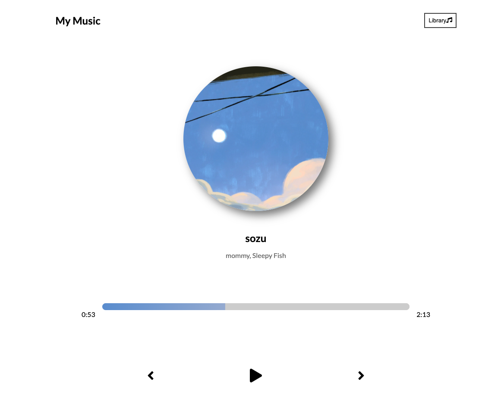
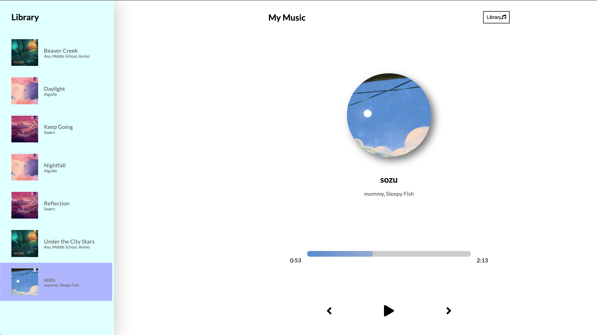
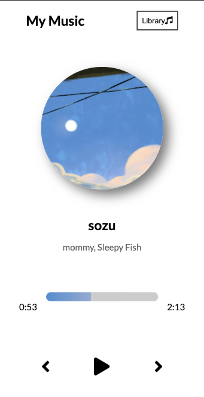

# Music-Player-App

</br>
<p align="center">
    
    
    
       
    
      
      
      
</p>

[](https://github.com/git/git-scm.com/blob/main/MIT-LICENSE.txt)

## Description

This application is a Music Player app built with react. The user can listen to all the songs that are located in the app. The play feature can be on click of play button or space bar hit, also skip a track with the right arrow or go back with the left arrow. Enjoy!

## User Story

```
As a listener and music lover I would like to hear an artists music on a slick UI design.
```

## Table of Contents

- [Usage](#usage)
- [Mobile View](#mobile-view)
- [Links](#links)
- [Technologies Used](#technologies-used)
- [License](#license)
- [Contributions](#contributions)
- [Questions](#questions)

## Usage




## Mobile View



## Links

- Heroku demo site link: (https://cryptic-taiga-39767.herokuapp.com/)
- Github Repository URL: (https://github.com/CliffordMorin/Music-Player-App)

## Technologies Used

<p align="center">
    <a href="https://developer.mozilla.org/en-US/docs/Web/HTML"></a>
    <a href="https://developer.mozilla.org/en-US/docs/Web/CSS"></a>
    <a href="https://www.javascript.com/"></a>
    <a href="https://www.framer.com/motion/"></a>
    <a href="https://reactjs.org/"></a>
      <a href="https://fontawesome.com/v5.15/how-to-use/on-the-web/using-with/react"></a>
</p>

## License

[](https://github.com/git/git-scm.com/blob/main/MIT-LICENSE.txt)

## Contributions

Fork, request, or contact me.

## Questions

[](https://github.com/CliffordMorin)
[](https://www.linkedin.com/in/morin-clifford-129888a9/)

Feel free to reach me at cemorin21@gmail.com with any question regarding this project!
